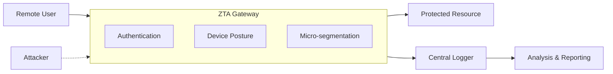

# Zero Trust Architecture (ZTA) Simulator

A Python-based simulation testbed for evaluating Zero Trust Architecture (ZTA) controls in hybrid work environments. Generate synthetic events, simulate attacks, and analyze the effectiveness of ZTA policies.

## Architecture



## Quick Start

This project can be run fully using Python virtual environments and the provided requirements.txt. Docker was previously supported but is no longer required.

1. Create a virtual environment:
```bash
python -m venv venv
source venv/bin/activate  # or `venv\Scripts\activate` on Windows
```

2. Install dependencies:
```bash
pip install -r requirements.txt
pip install -e .  # Install in development mode
```

3. Generate sample events:
```bash
python -m src.sim.run_sim --count 5 --mode zta --seed 1 --out data/sample_logs.jsonl
```

4. Run an experiment:
```bash
python -m src.sim.experiment --config configs/sample_experiment.json --mode zta --run-id test_run --seed 1
```

5. Run tests:
```bash
pytest -q --cov=src --cov-report=term-missing
```

6. Run linting:
```bash
flake8 src tests
mypy src tests
```

## Project Structure

```
my-zta-project/
├── src/
│   ├── sim/          # Simulation engine
│   ├── controls/     # ZTA control implementations
│   ├── logging/      # Centralized logging
│   └── api/          # Optional FastAPI service
├── tests/            # Test suite
├── data/             # Generated data & logs
├── analysis/         # Analysis notebooks & scripts
└── configs/          # Experiment configurations
```

## Development

- Python 3.11+
- Type hints enforced
- Tests with pytest
- Black for formatting
- Flake8 for linting
- MyPy for type checking

## License

MIT

## Contributing

See [CONTRIBUTING.md](CONTRIBUTING.md) for guidelines.
